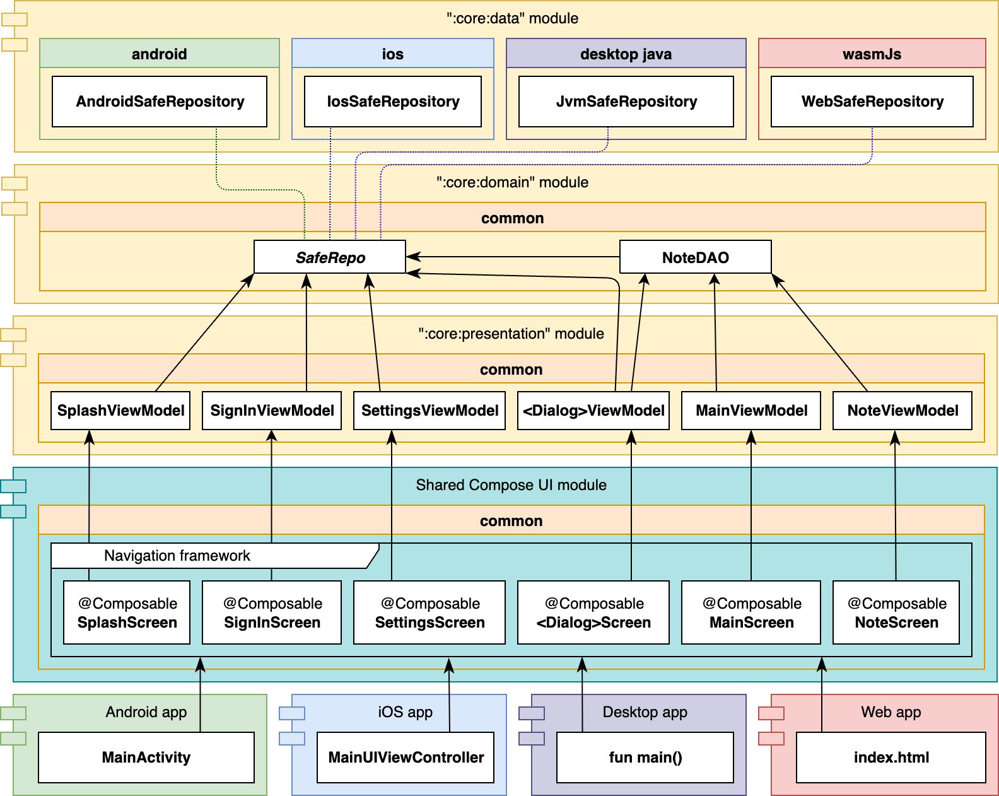

# NoteDelight 📝🔐

[Kotlin Multiplatform](https://kotlinlang.org/lp/mobile/) application for create notes in SQLite
database with [SQLDelight](https://github.com/cashapp/sqldelight) library, and encrypt it
with [Cipher](https://www.zetetic.net/sqlcipher/). The Compose-UI also has dark/light themes.

Supported platforms:

- Android
- iOS (the iPad version also works on macOS)
- Desktop JVM (macOS, Linux, Windows)

## ARCHITECTURE 🏛

## SCREENSHOTS 🎞️

        

## WORK IN PROGRESS 🛠

| feature \ platform | Android | iOS | Desktop Java |
|:------------------:|:-------:|:---:|:------------:|
|      database      |    ✅    | ✅	  |      ✅	      |
|     encryption     |    ✅    |  	  |              |
|         ui         |    ✅    | ✅	  |      ✅	      |

Check out [CONTRIBUTING.md](/CONTRIBUTING.md) if you want to develop missing features.

## LIBRARY DEPENDENCIES 📇

- [SQLDelight](https://github.com/cashapp/sqldelight)
- [SQLCipher](https://github.com/sqlcipher/sqlcipher)
- [kotlinx-coroutines](https://github.com/Kotlin/kotlinx.coroutines)
- [kotlinx-datetime](https://github.com/Kotlin/kotlinx-datetime)
- [Decompose](https://github.com/arkivanov/Decompose)
- [Compose Multiplatform, by JetBrains](https://github.com/JetBrains/compose-jb)
- [MaterialThemePrefs](https://github.com/softartdev/MaterialThemePrefs)
- [moko-resources](https://github.com/icerockdev/moko-resources)
- [Koin](https://github.com/InsertKoinIO/koin)
- [CWAC-SafeRoom](https://github.com/commonsguy/cwac-saferoom)
- [Napier](https://github.com/AAkira/Napier)
- [Firebase Crashlytics](https://firebase.google.com/products/crashlytics)
- [LeakCanary 🐤](https://github.com/square/leakcanary)
- [Mockito](https://github.com/mockito/mockito)
- [Turbine](https://github.com/cashapp/turbine)
- [Orchestrator](https://developer.android.com/training/testing/instrumented-tests/androidx-test-libraries/runner#use-android)
- [Espresso](https://developer.android.com/training/testing/espresso)

Made with JetBrains tools
