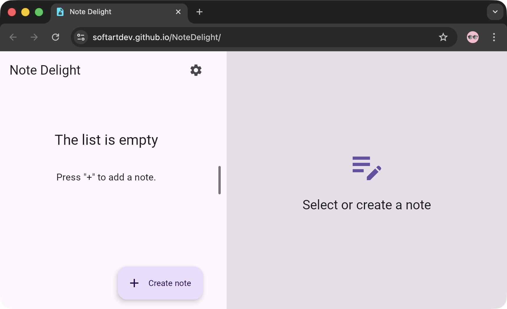
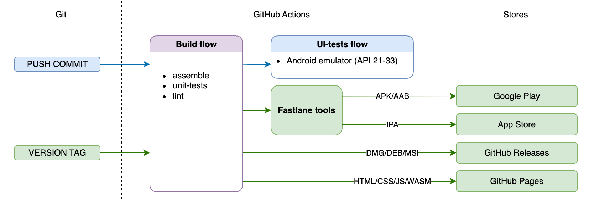

# Note Delight 📝🔐

[Kotlin Multiplatform](https://kotlinlang.org/lp/mobile/) application for create notes in SQLite
database with [SQLDelight](https://github.com/cashapp/sqldelight) library, and encrypt it
with [Cipher](https://www.zetetic.net/sqlcipher/). The Compose-UI also has dark/light themes and 
adaptive phone/tablet layouts. Localizations: en/ru.

Supported platforms:

- Android
- iOS (+ macOS [(Mac Catalyst)](https://developer.apple.com/mac-catalyst/))
- Desktop JVM (macOS, Linux, Windows)x(x86_64, arm64)
- Web (experimental - in development preview)

## SCREENSHOTS 🎞️

  

[More screenshoots…](/docs/screenshoots/screenshots.md)

## ARCHITECTURE 🏛

## WORK IN PROGRESS 🛠

| feature \ platform | Android | iOS | Desktop Java | Web |
|:------------------:|:-------:|:---:|:------------:|:---:|
|      database      |    ✅    | ✅	  |      ✅	      |  ✅  |
|     encryption     |    ✅    | ✅ 	 |              |     |
|         ui         |    ✅    | ✅	  |      ✅	      |  ✅  |

Check out [CONTRIBUTING.md](/CONTRIBUTING.md) if you want to develop missing features.

## CONTINUOUS INTEGRATION / DELIVERY ♻️

## DOCUMENTATION 📖

- **[docs/README.md](docs/README.md)** - Documentation index and quick reference
- **[docs/MANUAL_BUILD_INSTALL.md](docs/MANUAL_BUILD_INSTALL.md)** - Manual build and install guide for all platforms
- **[CONTRIBUTING.md](CONTRIBUTING.md)** - Contribution guidelines, code style, development workflow
- **Module READMEs** - Each module folder has detailed documentation

## LIBRARY DEPENDENCIES 📚

- [SQLDelight](https://github.com/cashapp/sqldelight)
- [SQLCipher](https://github.com/sqlcipher/sqlcipher)
- [Compose Multiplatform, by JetBrains](https://github.com/JetBrains/compose-jb)
- [MaterialThemePrefs](https://github.com/softartdev/MaterialThemePrefs)
- [kotlinx-coroutines](https://github.com/Kotlin/kotlinx.coroutines)
- [kotlinx-datetime](https://github.com/Kotlin/kotlinx-datetime)
- [Koin](https://github.com/InsertKoinIO/koin)
- [CWAC-SafeRoom](https://github.com/commonsguy/cwac-saferoom) - my [fork](https://github.com/softartdev/cwac-saferoom)
- [Kermit](https://github.com/touchlab/Kermit)
- [Firebase Crashlytics](https://firebase.google.com/products/crashlytics)
- [LeakCanary 🐤](https://github.com/square/leakcanary)
- [Mockito](https://github.com/mockito/mockito)
- [Turbine](https://github.com/cashapp/turbine)
- [Orchestrator](https://developer.android.com/training/testing/instrumented-tests/androidx-test-libraries/runner#use-android)
- [Espresso](https://developer.android.com/training/testing/espresso)
