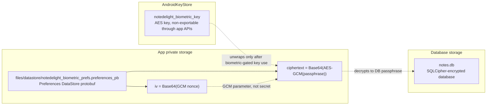
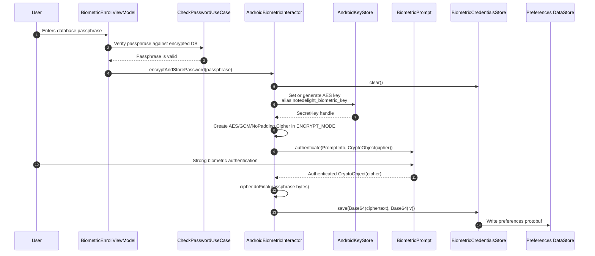
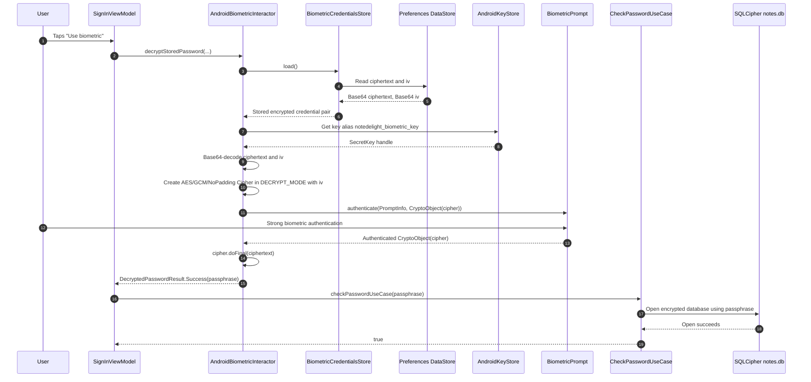
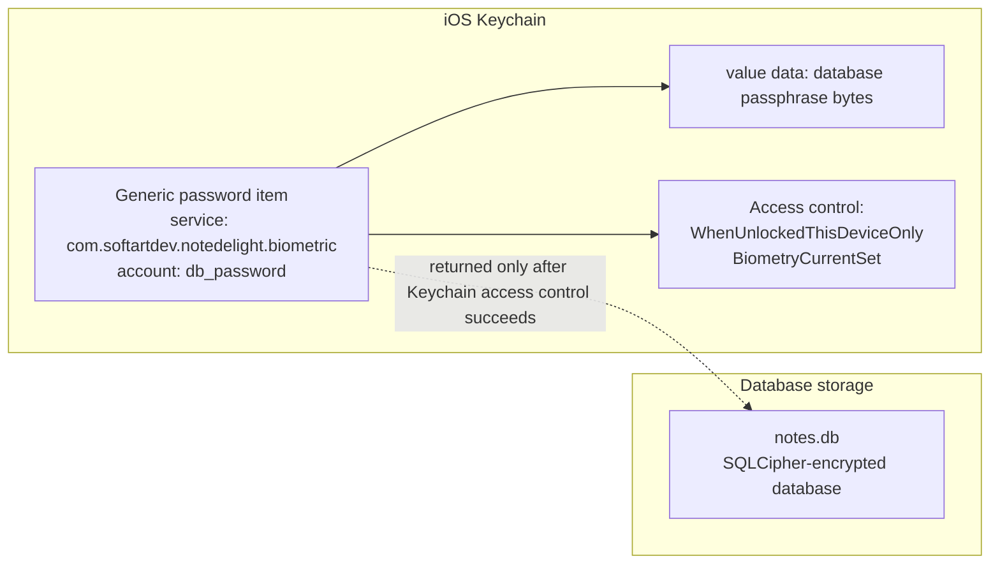
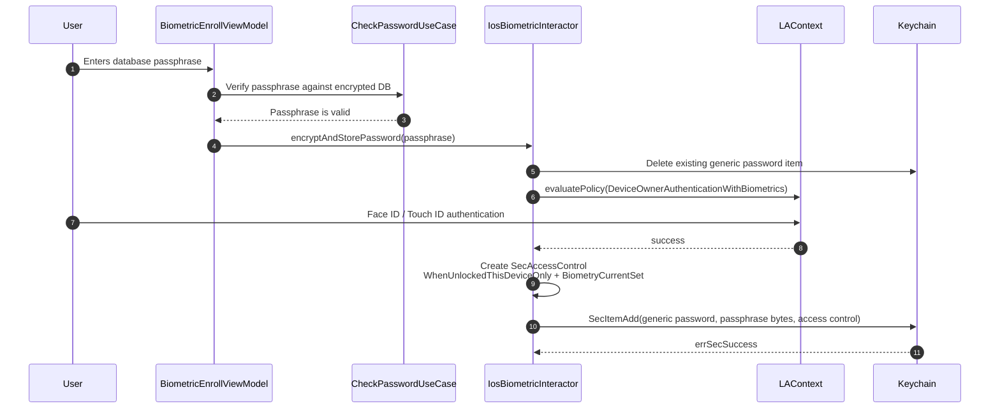
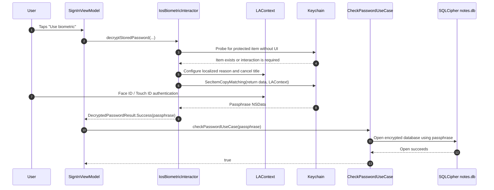
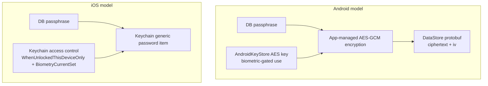

# Biometric Encryption and Key Storage

This document describes how NoteDelight stores and uses the database passphrase when biometric sign-in is enabled on Android and iOS.

The biometric feature does not replace SQLCipher database encryption. It stores a recoverable copy of the existing database passphrase so the app can unlock the encrypted database after a successful biometric prompt.

## Summary

| Platform | Where the database passphrase is stored | What protects it | What app storage contains |
| --- | --- | --- | --- |
| Android | Encrypted by an Android Keystore AES-GCM key, then stored in Preferences DataStore | Android Keystore key with user authentication required; biometric prompt receives the `Cipher` as a `CryptoObject` | A protobuf DataStore file containing Base64 `ciphertext` and Base64 `iv` |
| iOS | Stored as a Keychain generic password item | Keychain item access control: `kSecAttrAccessibleWhenUnlockedThisDeviceOnly` and `kSecAccessControlBiometryCurrentSet` | No app-level ciphertext file for the biometric password |

Important Android nuance: the implementation uses `AndroidKeyStore`, but it does not currently require StrongBox with `setIsStrongBoxBacked(true)` or verify the hardware security level with `KeyInfo`. On devices with hardware-backed Keystore support, key operations may be backed by TEE or StrongBox. The code should not be described as always StrongBox-backed.

## Android

### Components

| Component | Code | Stored data |
| --- | --- | --- |
| `AndroidBiometricInteractor` | `feature/biometric/domain/src/androidMain/.../AndroidBiometricInteractor.kt` | Creates and uses the Android Keystore key and biometric-gated `Cipher` |
| `BiometricCredentialsStore` | `feature/biometric/domain/src/androidMain/.../BiometricCredentialsStore.kt` | Stores Base64 `ciphertext` and Base64 `iv` in Preferences DataStore |
| SQLCipher database opener | `core/data/db-sqldelight/src/androidMain/.../AndroidDatabaseHolder.kt` | Receives the decrypted passphrase and opens `notes.db` through `SafeHelperFactory.fromUser(...)` |

### Data at Rest



The DataStore file itself is not an encrypted container. It is a binary protobuf file. Opening it as text may show readable keys such as `ciphertext` and `iv` mixed with non-printable protobuf bytes.

Example:

```text
ciphertext = +/SD9SOMtFleDQVD5+H9os4=
iv         = qqSQOxJBoPsziWjT
```

The Base64 values can be decoded into bytes, but the decoded `ciphertext` is still AES-GCM ciphertext. The file alone is not enough to recover the database passphrase.

### Enrollment Flow



The app does not write the plaintext passphrase to DataStore. It writes only the AES-GCM output and the IV.

### Sign-In Flow



After `Cipher.init(DECRYPT_MODE, key, GCMParameterSpec(..., iv))`, the IV is part of the initialized cipher state. In a Kotlin coroutine debugger, local variables that are no longer live after a suspension point may appear as `null`. That does not mean the password was derived from `null`; it means the compiler-generated coroutine state machine no longer needs to retain those locals.

### What Is Protected by the Android Security Hardware

The app asks `AndroidKeyStore` to create an AES key with:

- alias: `notedelight_biometric_key`
- purposes: encrypt and decrypt
- block mode: GCM
- padding: none
- user authentication required
- biometric enrollment invalidation on API 24+

The database passphrase is not stored in the secure hardware. The Keystore key is the protected object. The app receives a `SecretKey` handle and a `Cipher`, not raw key bytes. The encrypted passphrase remains in normal app storage as DataStore bytes.

Because the current code does not request or verify StrongBox, use precise language:

- Correct: "The passphrase is encrypted with an Android Keystore key and can be decrypted only by this app's Keystore entry after successful biometric-gated key use."
- Too strong for the current code: "The key is always stored in a separate secure chip."

### Can the DataStore File Be Decrypted Manually?

Not from the file alone.

An offline copy of `files/datastore/notedelight_biometric_prefs.preferences_pb` reveals:

- that biometric sign-in has stored credentials;
- the preference keys `ciphertext` and `iv`;
- the ciphertext length;
- the GCM IV.

It does not reveal:

- the database passphrase;
- the Android Keystore AES key;
- raw key material that could be used on another device or by another app UID.

The Android app decrypts it by running on the same device, under the same app UID, retrieving the Keystore entry by alias, initializing AES-GCM with the stored IV, passing that cipher through `BiometricPrompt`, and then calling `doFinal(ciphertext)` after successful authentication.

## iOS

### Components

| Component | Code | Stored data |
| --- | --- | --- |
| `IosBiometricInteractor` | `feature/biometric/domain/src/iosMain/.../IosBiometricInteractor.kt` | Stores and reads the passphrase as a Keychain generic password item |
| `IosDatabaseHolder` | `core/data/db-sqldelight/src/iosMain/.../IosDatabaseHolder.kt` | Receives the passphrase as `DatabaseConfiguration.Encryption(key, rekey)` |

### Data at Rest



iOS does not use an app-managed DataStore ciphertext file for the biometric passphrase. The app stores the passphrase bytes directly as a Keychain item, and Keychain applies the platform protection and biometric access control.

### Enrollment Flow



The method name `encryptAndStorePassword` is shared across platforms, but on iOS the app does not perform its own AES encryption before storing the passphrase. The encryption and access control are provided by Keychain.

### Sign-In Flow



### What Is Protected by Secure Enclave and Keychain

The Keychain item is created with:

- class: generic password;
- service: `com.softartdev.notedelight.biometric`;
- account: `db_password`;
- accessibility: `kSecAttrAccessibleWhenUnlockedThisDeviceOnly`;
- access control: `kSecAccessControlBiometryCurrentSet`.

The app does not store a separate wrapping key or IV. Keychain stores and protects the item. Secure Enclave participates in biometric authentication and keybag access decisions, while the app receives the passphrase only after the Keychain query succeeds.

`BiometryCurrentSet` is important: if the current biometric enrollment changes, the protected item should no longer be readable with the old access control state.

## Principal Android vs iOS Difference



Android splits the design into app storage plus Keystore-protected key use:

- normal app storage contains encrypted credential material;
- Android Keystore contains the key entry or key operation capability;
- the app performs AES-GCM encryption and decryption.

iOS delegates storage and access control to Keychain:

- Keychain stores the protected secret item;
- the app does not store app-level ciphertext and IV;
- Keychain returns the secret only after access control succeeds.

## Residual Risks

This design protects against offline extraction of normal app files. It does not protect against every local compromise scenario.

Relevant residual risks:

- A rooted device, debugger, Frida/Xposed hook, or malicious code running inside the app process can observe the plaintext passphrase after successful biometric authentication.
- The passphrase must exist transiently in app memory because SQLCipher needs it to open the database.
- Android DataStore reveals metadata such as the presence of a stored biometric credential and ciphertext length.
- Android hardware-backed protection depends on the device and Keystore provider unless the app explicitly requests and verifies StrongBox or hardware security level.
- Biometric authentication is an unlock convenience for an existing database passphrase, not a replacement for the passphrase itself.

## Implementation References

- Android storage: `feature/biometric/domain/src/androidMain/kotlin/com/softartdev/notedelight/interactor/BiometricCredentialsStore.kt`
- Android encryption/decryption: `feature/biometric/domain/src/androidMain/kotlin/com/softartdev/notedelight/interactor/AndroidBiometricInteractor.kt`
- Android database opening: `core/data/db-sqldelight/src/androidMain/kotlin/com/softartdev/notedelight/db/AndroidDatabaseHolder.kt`
- iOS Keychain storage: `feature/biometric/domain/src/iosMain/kotlin/com/softartdev/notedelight/interactor/IosBiometricInteractor.kt`
- iOS database opening: `core/data/db-sqldelight/src/iosMain/kotlin/com/softartdev/notedelight/db/IosDatabaseHolder.kt`
