## SCREENSHOTS

These screenshots are generated from dedicated Compose Preview functions in
`core/test/ui/src/androidMain/kotlin/com/softartdev/notedelight/screenshot_preview/ScreenshootPreview.kt`.
See [docs/SCREENSHOTS.md](../SCREENSHOTS.md) for the generation workflow.

### Phone - Light

  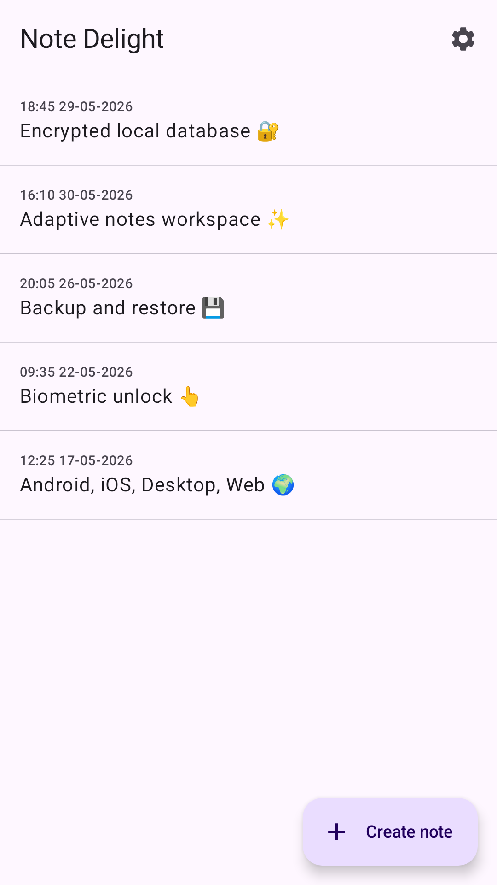
  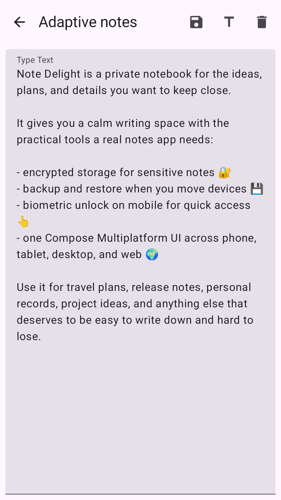
  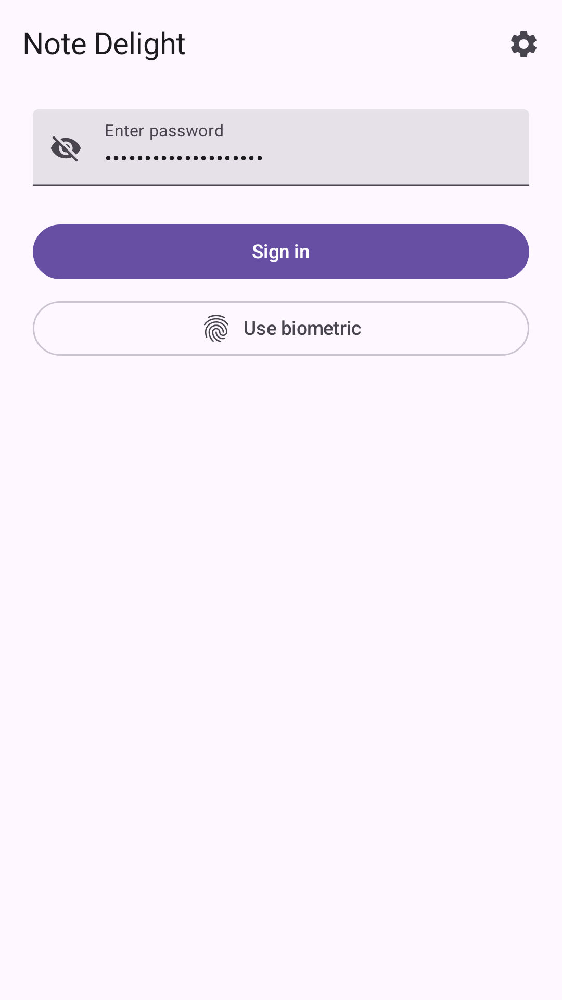
  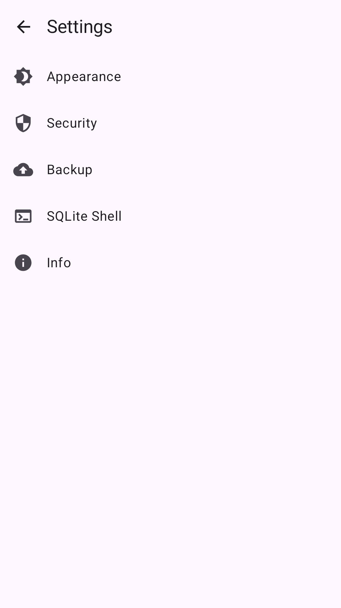

### Phone - Dark

  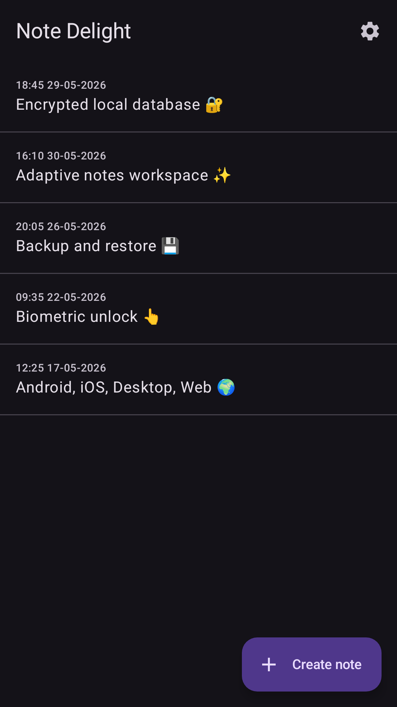
  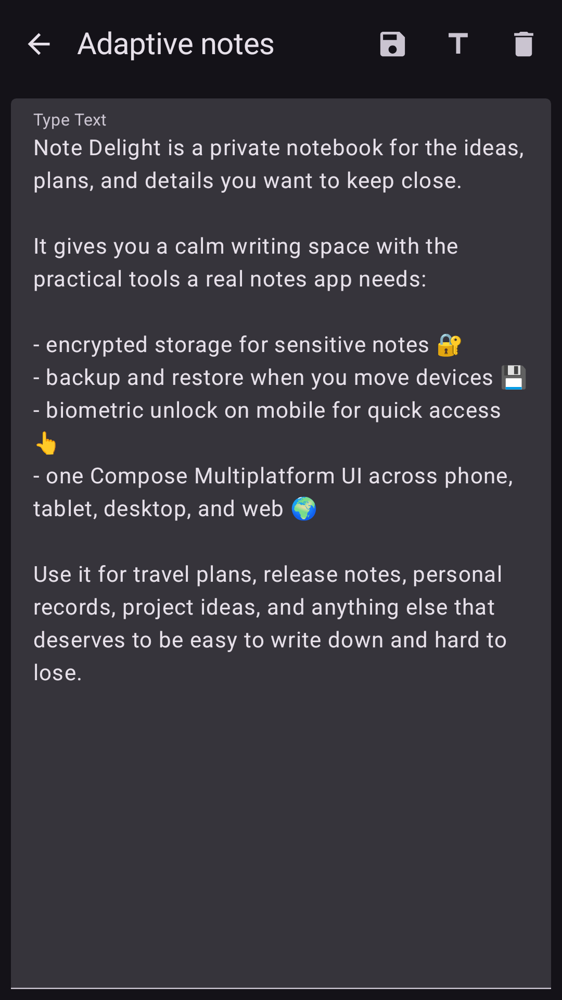
  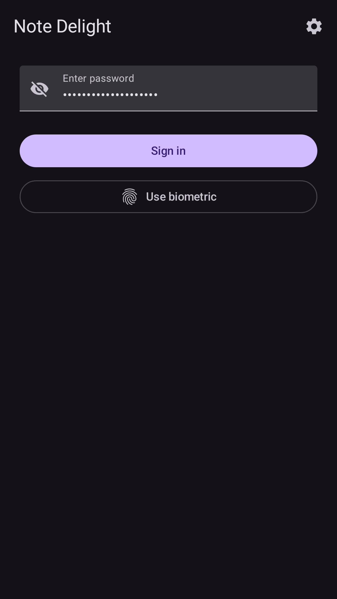
  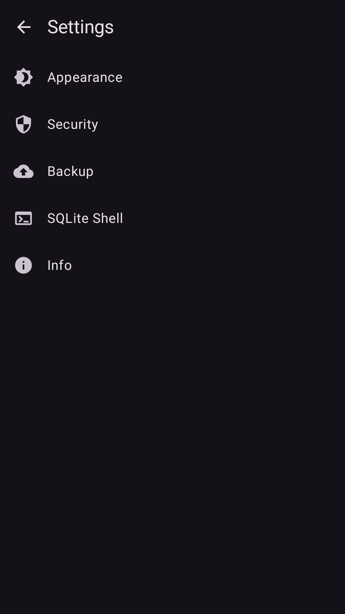

### Tablet - Light

  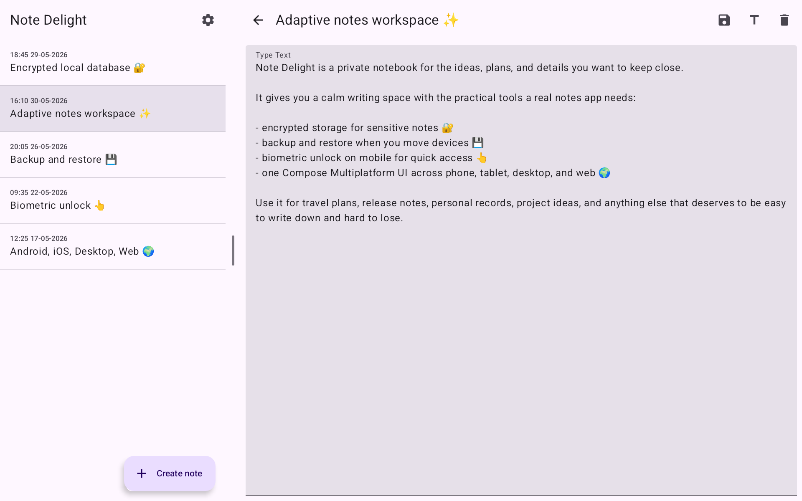
  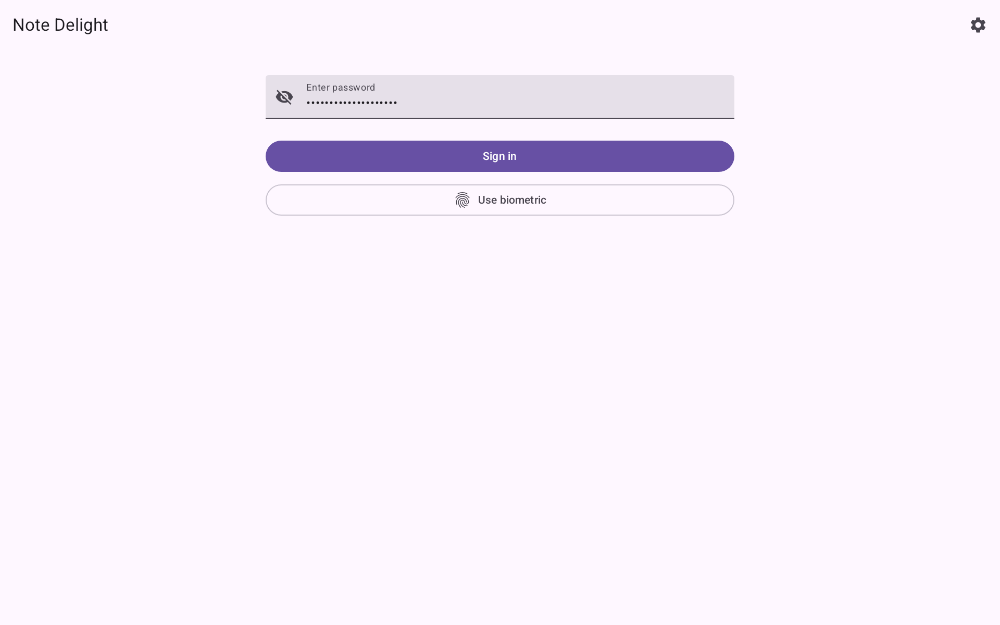
  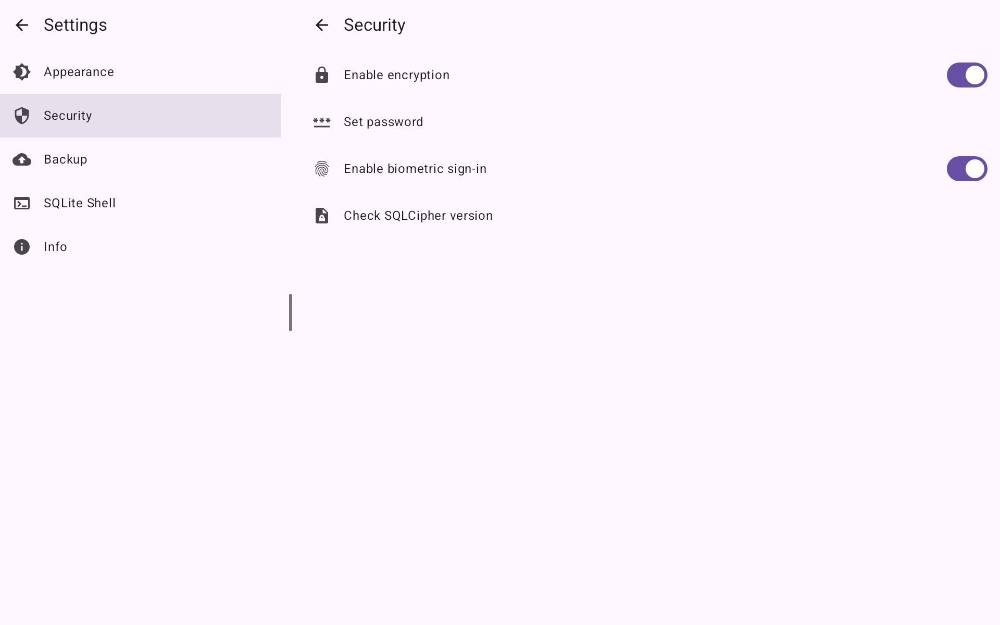

### Tablet - Dark

  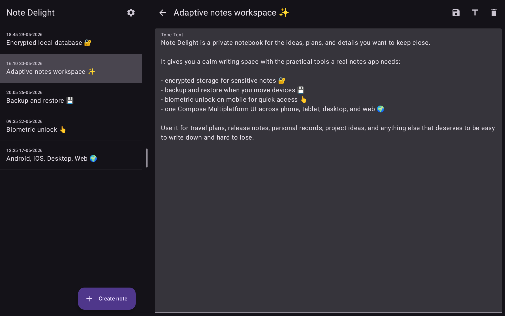
  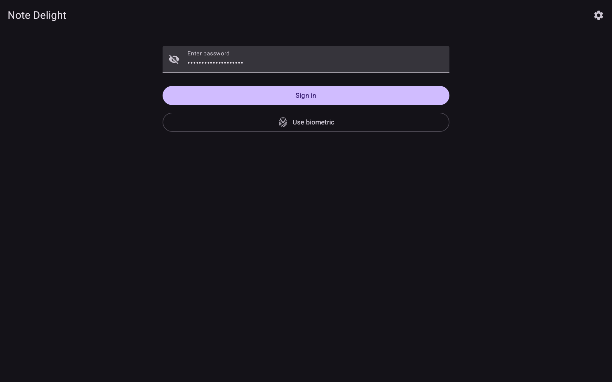
  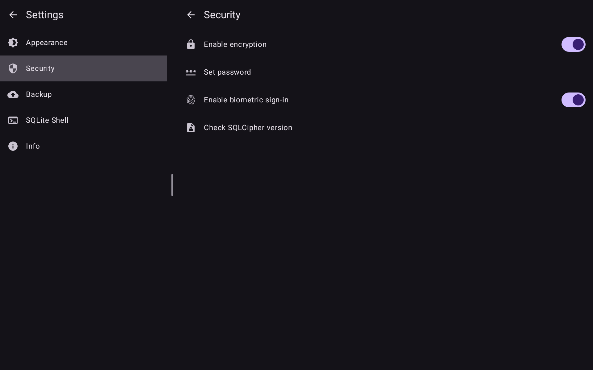

